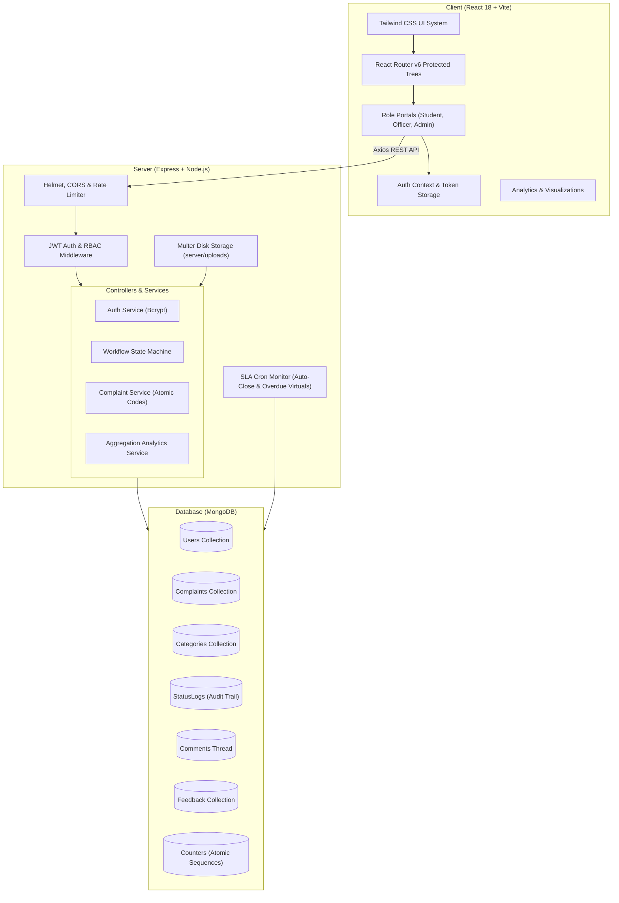

# Campus Complaint & Grievance Redressal System

A production-grade, centralized campus grievance redressal and tracking web application designed for higher education institutions. Built with the **MERN** stack (MongoDB, Express, React, Node.js), this system provides end-to-end transparency, role-based workflows, SLA enforcement, and administrative analytics.

---

## Architecture Diagram



---

## Core Features

- **Role-Based Access Control (RBAC)**: Distinct, isolated experiences for **Students/Staff** (complainants), **Grievance Officers** (department authorities), and **Administrators** (management & analytics).
- **Automated Workflow State Machine**: Strict lifecycle enforced on the backend: `Submitted` → `Acknowledged` → `In Progress` → `Resolved` → `Closed`. Illegal status jumps are prevented.
- **SLA & Overdue Tracking**: Automatic calculation of SLA due dates based on priority (`High: 2 days`, `Medium: 5 days`, `Low: 7 days`). Visual overdue warnings and real-time days overdue indicators.
- **Anonymous Filing**: Complainants can choose to conceal their identity. Anonymous flags mask filer names as "Anonymous" to officers and admins.
- **Automated Officer Assignment**: Categories can define a `defaultHandler`. Complaints filed under that category are automatically assigned upon creation and advanced to `Acknowledged`.
- **Confidential Investigation Notes**: Officers and admins can post internal notes on complaints that are completely hidden from complainants.
- **Verification & Complainant Feedback**: Once resolved, complainants can verify and close grievances with star ratings (1–5) and feedback, or reopen with reasons.
- **Admin Analytics Dashboard**: High-level KPI cards and 5 interactive Recharts visualizations (status donut, 6-month resolution trend, category horizontal bar, department volume, priority severity distribution).
- **Client-Side CSV Export**: Admins can export filtered complaint views to RFC 4180-compliant CSV files generated in-browser via DOM Blob.
- **Multi-File Uploads**: Drag-and-drop support for up to 3 attachments (`.jpg`, `.png`, `.pdf`, max 5 MB each), streamed through authenticated backend routes.

---

## Tech Stack

### Frontend (`/client`)
- **Core**: React 18, Vite 8, Plain JavaScript (JSX)
- **Styling**: Tailwind CSS v4, Lucide React Icons
- **Routing & Networking**: React Router DOM v6, Axios
- **Charts & Feedback**: Recharts v3, React Hot Toast
- **Architecture**: Context API state management, custom `useFetch` hook with background polling, no heavy external UI libraries.

### Backend (`/server`)
- **Runtime & Framework**: Node.js 18+, Express 4 (CommonJS)
- **Database**: MongoDB via Mongoose 7+
- **Security & Auth**: JSON Web Tokens (`jsonwebtoken`), Bcrypt (`bcryptjs`), Helmet, CORS, Express Rate Limit
- **File Storage**: Multer (Local disk storage)
- **Automation**: Node Cron (Background SLA tracking)
- **Code Standards**: Plain hand-written validators, structured API envelope (`success`, `data`, `meta`, `errors`).

---

## Prerequisites

- **Node.js**: `v18.x` or higher
- **MongoDB**: Active MongoDB instance on `mongodb://127.0.0.1:27017` (local daemon or Docker container)
- **npm**: `v9.x` or higher

---

## Setup & Installation

### 1. Clone & Environment Setup

```bash
git clone https://github.com/SharadPandey01/Grievance-Redressal-System.git
cd Grievance-Redressal-System
```

### 2. Backend Setup

```bash
cd server
npm install
```

Configure `server/.env` (created from `server/.env.example`):
```env
PORT=5000
MONGODB_URI=mongodb://127.0.0.1:27017/campus_grievance
MONGODB_URI_TEST=mongodb://127.0.0.1:27017/campus_grievance_test
JWT_SECRET=a1b2c3d4e5f6a1b2c3d4e5f6a1b2c3d4e5f6a1b2c3d4e5f6a1b2c3d4e5f6a1b2
JWT_EXPIRES_IN=7d
CLIENT_URL=http://localhost:5173
ALLOWED_EMAIL_DOMAIN=
AUTO_CLOSE_DAYS=7
UPLOAD_DIR=uploads
```

Seed initial database demo accounts and categories:
```bash
npm run seed
```

Start the backend server:
```bash
npm run dev
# Server listening on http://localhost:5000
```

### 3. Frontend Setup

In a new terminal window:
```bash
cd client
npm install
npm run dev
# Vite dev server running on http://localhost:5173
```

---

## Demo Credentials

All seeded demo accounts share the password: `Password@123`

| Email | Role | Department | Description |
|---|---|---|---|
| `admin@campus.edu` | Admin | Campus Administration | Full system access, categories, user accounts, and analytics |
| `officer.hostel@campus.edu` | Officer | Hostel Administration | Triage and resolves hostel grievances |
| `officer.it@campus.edu` | Officer | IT Support | Triage and resolves networking and computer lab issues |
| `officer.academic@campus.edu`| Officer | Academic Affairs | Triage and resolves coursework and examination issues |
| `student1@campus.edu` | Student | Computer Science | Complainant account for filing and tracking grievances |
| `student2@campus.edu` | Student | Mechanical Engineering | Complainant account |
| `staff1@campus.edu` | Staff | Library Services | Complainant account for staff grievances |

---

## Useful Commands

### Server (`/server`)
- `npm run dev`: Start development server with nodemon auto-reload
- `npm run seed`: Populate database with fresh seed accounts, master categories, and sample grievances
- `npm test`: Run backend unit and integration test suite

### Client (`/client`)
- `npm run dev`: Start Vite development server on port 5173
- `npm run lint`: Run Oxlint code analysis
- `npm run build`: Compile production bundle to `dist/`
- `npm run preview`: Preview production build locally

---

## Project Directory Structure

```
.
├── client/
│   ├── public/             Static assets (favicons, icons)
│   ├── src/
│   │   ├── api/            Axios API client wrappers
│   │   ├── components/
│   │   │   ├── layout/     AppLayout, Navbar, Sidebar
│   │   │   ├── ui/         Accessible Tailwind UI components (Modal, Tabs, Toggle, etc.)
│   │   │   └── ErrorBoundary.jsx  Global error catcher
│   │   ├── context/        AuthContext & session management
│   │   ├── features/
│   │   │   └── complaints/ Table, Cards, Timeline, Comments, Actions & Modals
│   │   ├── hooks/          Custom hooks (useAuth, useFetch)
│   │   ├── lib/            Constants, formatters, validators
│   │   ├── pages/          Portal pages (Dashboard, Details, Officer, Admin, Profile)
│   │   ├── routes/         Route protection and RBAC guards
│   │   ├── App.jsx         Root application entry
│   │   └── main.jsx        Vite bootstrapping
│   └── package.json
├── server/
│   ├── scripts/            Seed and diagnostic scripts
│   ├── src/
│   │   ├── config/         Environment and database loaders
│   │   ├── controllers/    Thin Express route controllers
│   │   ├── jobs/           Background SLA cron monitor
│   │   ├── middleware/     JWT authentication, error handling, rate limiting
│   │   ├── models/         Mongoose schemas (Complaint, User, Category, etc.)
│   │   ├── routes/         Express API routes
│   │   ├── services/       Business logic and state machine
│   │   └── utils/          Logger, response envelope, custom ApiError
│   └── package.json
└── docs/
    ├── API_CONTRACT.md     Detailed REST endpoint specification
    ├── E2E_CHECKLIST.md    Manual QA test cases and verified results
    ├── PROGRESS.md         Chronological engineering development log
    └── PROJECT_CONTEXT.md  Product specifications and design requirements
```

---

## Known Limitations

- **Email Notifications**: Outbound email (SMTP/SES) is disabled by design per project requirements; status updates are communicated in-app via polling and timelines.
- **Single Department Assignment**: Officers currently belong to one primary administrative department.

---

## Future Scope

- **Real-Time WebSockets**: Transitioning from 30-second polling to Socket.io for instantaneous message and status alerts.
- **Rich Text Formatter**: Markdown or WYSIWYG editor for grievance descriptions and resolution summaries.
- **SLA Escalation Hierarchy**: Multi-tier escalation automatically elevating tickets to campus deans if unresolved past grace periods.